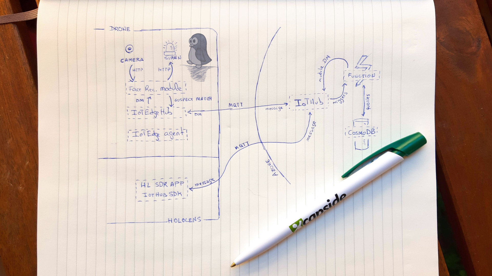
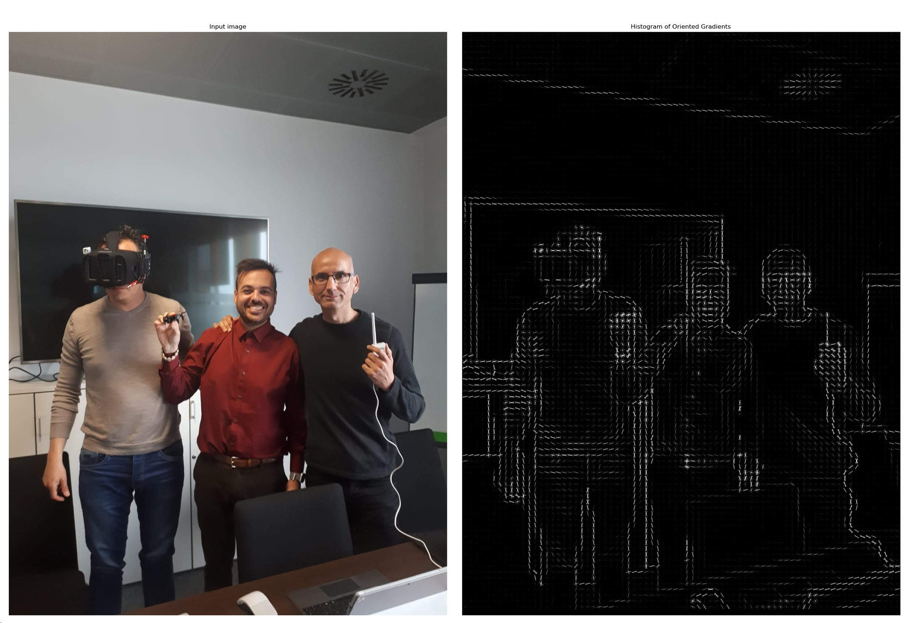

# IoT Face Recognition Demo

This repo contains an [IoT Edge](https://docs.microsoft.com/en-us/azure/iot-edge/) solution developed using [VSCode IoT extension](https://marketplace.visualstudio.com/items?itemName=vsciot-vscode.azure-iot-edge) (highly recommended!).

## Architecture

The main module (FaceAPIServerModule) integrates the fantastic [face-api.js](https://github.com/justadudewhohacks/face-api.js?files=1) tensorflow wrapper for browser/nodejs face detection. If the detected face on the webcam matches the provided models, a new message is written in the [IotEdge-hub](https://docs.microsoft.com/en-us/azure/iot-edge/iot-edge-runtime#module-communication) and forwarded to the [Azure IoT Hub](https://azure.microsoft.com/services/iot-hub/) to be processed with an [Azure Function](https://azure.microsoft.com/services/functions/).

The function checks if the matched names are considered dangerous in a [CosmoDB](https://azure.microsoft.com/services/cosmos-db/) database and in that case uses the hub to send a [Direct Method Invocation](https://docs.microsoft.com/en-us/azure/iot-hub/iot-hub-devguide-direct-methods) to the IoT Edge Module.

If the IoT Edge Module method is invoked, it executes a HTTP query to change the state of a [Sonoff relay](https://www.itead.cc/sonoff-wifi-wireless-switch.html) (burnt with [Espurna](https://github.com/xoseperez/espurna) firmwared) to switch on a siren.

## Additional resources

The repository also includes several other examples, including a python example about how to create and visualize a [Histogram of Oriented gradients](https://en.wikipedia.org/wiki/Histogram_of_oriented_gradients) and [Facial landmarks](https://www.pyimagesearch.com/2017/04/03/facial-landmarks-dlib-opencv-python/).

